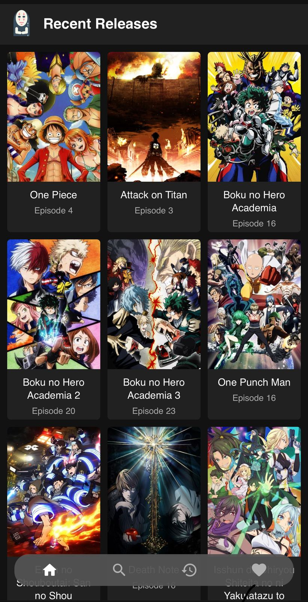
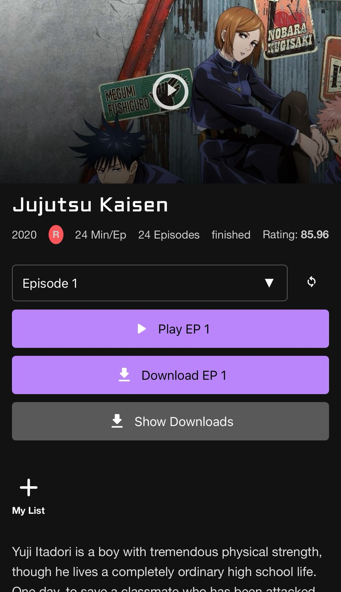
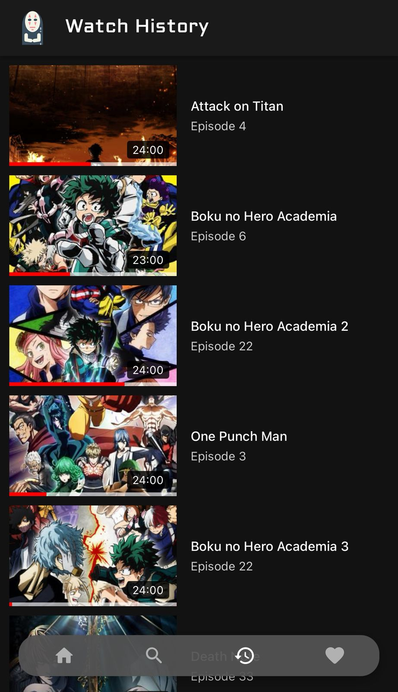

AniWatch - Android Anime Streaming App
======================================

A feature-rich Android application for streaming anime content, inspired by the user experience of YouTube and Netflix. This project was built during my early Android development journey as a learning exercise to understand mobile app development, API integration, and UI/UX design patterns.

📱 Overview
-----------

AniWatch provides anime enthusiasts with a seamless streaming experience, featuring a modern interface that combines YouTube's familiar navigation with Netflix's content discovery approach. The app aggregates anime content from multiple sources and presents it in an intuitive, user-friendly manner.

🖼️ User Interface Screenshots
------------------------------

| Home Screen (Recent Releases) | Anime Details Screen | Watch History Screen | 
|----------------|---------------------|-------------------|
|||  |

✨ Key Features
--------------

### 🎬 Content Discovery & Streaming

*   **Recent Releases**: Stay updated with the latest anime episodes in a grid-based layout
*   **Advanced Search**: Full-text search functionality with MongoDB Atlas integration
*   **Video Streaming**: Custom video player built with ExoPlayer for smooth playback experience
*   **Episode Management**: Easy navigation between episodes with thumbnail previews
*   **Quality Controls**: Playback speed adjustment and video quality options

### 📚 Personal Library Management

*   **My List**: Add/remove anime to personal watchlist with toggle functionality
*   **Watch History**: YouTube-style viewing history with progress tracking
*   **Resume Watching**: Pick up where you left off with precise playback position saving
*   **Progress Indicators**: Visual progress bars showing completion status for episodes

### ⬬ Downloads & Offline Viewing

*   **Episode Downloads**: Download episodes for offline viewing using Fetch2 library
*   **Download Management**: Comprehensive download queue with pause/resume/retry options
*   **Storage Management**: Organized file structure with built-in cleanup tools
*   **Progress Tracking**: Real-time download progress with speed and ETA indicators

### 🎨 User Interface & Experience

*   **Material Design**: Modern UI following Google's Material Design guidelines
*   **Dark Theme**: Eye-friendly dark theme implementation
*   **Custom Player Controls**: Intuitive video player with brightness/volume controls
*   **Responsive Layout**: Adaptive layouts for different screen sizes
*   **Smooth Animations**: Polished transitions and loading animations

🛠️ Technical Architecture
--------------------------

### Core Technologies

*   **Language**: Java (Android)
*   **Architecture**: Traditional Android architecture with modular design
*   **Database**:
    *   MongoDB Atlas (Cloud database)
    *   Realm Database (Local data persistence)
*   **Backend**: Python-based web scraping service hosted on Heroku
*   **Video Streaming**: ExoPlayer 2.15.1

### Libraries & Dependencies

#### **Networking & API**

gradle

    implementation 'com.squareup.retrofit2:retrofit:2.9.0'
    implementation 'com.squareup.retrofit2:converter-gson:2.9.0'
    implementation 'com.squareup.okhttp3:okhttp:5.0.0-alpha.2'
    implementation 'org.jsoup:jsoup:1.14.3'

#### **Database & Authentication**

gradle

    implementation 'io.realm:realm-gradle-plugin:10.8.0'

#### **Media & Downloads**

gradle

    implementation 'com.google.android.exoplayer:exoplayer:2.15.1'
    implementation "androidx.tonyodev.fetch2:xfetch2:3.1.6"

#### **Image Loading & UI**

gradle

    implementation 'com.github.bumptech.glide:glide:4.12.0'
    implementation 'com.google.android.material:material:1.4.0'

#### **Utilities**

gradle

    implementation 'org.projectlombok:lombok:1.18.20'

### Data Models & Architecture

#### **Core Data Models**

*   `AnimeMongo`: Main anime entity with MongoDB integration
*   `UserHistoryMongoModel`: Watch history tracking
*   `PlayerActivityDataModel`: Video player state management
*   `RecentReleasedAniViewModel`: Home screen content display

#### **Adapters & UI Components**

*   `RecentReleasedAniViewAdaptor`: Grid layout for anime catalog
*   `SearchResultAdaptor`: Search results with rich metadata display
*   `HistoryListAdaptor`: Watch history with progress indicators
*   `FileAdapter`: Download management interface

🔧 Key Implementation Features
------------------------------

### **Authentication & User Management**

*   Custom MongoDB authentication system
*   User session management with SharedPreferences
*   Automatic login with stored credentials

### **Video Streaming & Playback**

*   ExoPlayer integration with custom controls
*   Adaptive streaming with caching support
*   Picture-in-picture mode considerations
*   Advanced playback controls (speed, brightness, volume)

### **Data Synchronization**

*   Real-time sync between local Realm database and MongoDB Atlas
*   Offline-first approach with sync when connectivity restored
*   Background updates for recent releases

### **Download System**

*   Multi-threaded downloading with Fetch2
*   Download queue management
*   Storage optimization and cleanup
*   Error handling and retry mechanisms

### **Search Implementation**

*   MongoDB Atlas Search with full-text indexing
*   Debounced search input for performance
*   Rich search results with metadata display
*   Search history and suggestions

📁 Project Structure
--------------------

    AniWatch/
    ├── app/src/main/java/com/abhi245y/aniwatch/
    │   ├── Adaptors/           # RecyclerView adapters
    │   ├── backend/            # Utility classes and helpers
    │   ├── datamodels/         # Data models and POJOs
    │   ├── services/           # API service interfaces
    │   └── ui/                 # Activities and fragments
    ├── res/
    │   ├── layout/             # XML layout files
    │   ├── drawable/           # Vector icons and graphics
    │   └── values/             # Strings, colors, themes

🎯 Features Breakdown
---------------------

### **Home Screen (Recent Releases)**

*   Grid layout displaying latest anime episodes
*   Pull-to-refresh functionality
*   Auto-update mechanism for new content
*   Netflix-style content cards with hover effects

### **Search Functionality**

*   Real-time search with MongoDB Atlas Search
*   Advanced filtering and sorting options
*   Search result cards with anime metadata
*   Genre-based filtering system

### **Video Player**

*   Custom controls with Material Design
*   Gesture-based brightness and volume control
*   Episode navigation with thumbnails
*   Skip intro functionality
*   Playback speed controls

### **My List Management**

*   Toggle-based add/remove functionality
*   Visual feedback for list status
*   Sync across devices via MongoDB
*   Category-based organization

### **Download Manager**

*   Queue-based download system
*   Background downloading support
*   Download progress tracking
*   File organization and management

🚀 Getting Started
------------------

### Prerequisites

*   Android Studio Arctic Fox or later
*   Android SDK 25+
*   Java 8+

### Installation

1.  Clone the repository
2.  Open project in Android Studio
3.  Sync Gradle dependencies
4.  Configure MongoDB Atlas connection
5.  Build and run the application

**Note**: This project requires a backend service for anime data scraping, which was originally hosted on Heroku but is no longer available.

📝 Configuration
----------------

### MongoDB Setup

Update the MongoDB App ID in `MongoDBAuth.java`:

java

    String appID = "your-mongodb-app-id";

### API Endpoints

Configure base URLs in respective service classes:

java

    String BASE_URL_ANI_API = "https://your-api-endpoint.com/";

🔒 Permissions
--------------

The app requires the following permissions:

*   `INTERNET` - Network access for streaming and API calls
*   `ACCESS_NETWORK_STATE` - Network connectivity checking
*   `WRITE_EXTERNAL_STORAGE` - Download functionality
*   `READ_EXTERNAL_STORAGE` - File access for downloads
*   `WAKE_LOCK` - Prevent sleep during video playback

🐛 Known Issues
---------------

*   Some video links may not work due to external source limitations
*   Download feature requires storage permissions setup
*   Backend service dependency for full functionality

🔮 Future Enhancements
----------------------

*   Modernize to Kotlin with MVVM architecture
*   Implement proper dependency injection (Dagger/Hilt)
*   Add support for multiple streaming sources
*   Implement offline-first architecture with Room database
*   Add social features (ratings, reviews, sharing)

📄 License
----------

This project is for educational purposes only. Please respect copyright laws and only use this code for learning Android development concepts.

🤝 Contributing
---------------

This is a personal learning project from my early Android development days. While not actively maintained, feel free to fork and experiment with the codebase for your own learning journey.

* * *

**Note**: This was one of my early Android projects (3rd app) built for learning purposes. The code reflects the development practices and libraries available 4+ years ago, and serves as a good reference for understanding traditional Android development approaches before modern architectural patterns like MVVM became standard.
